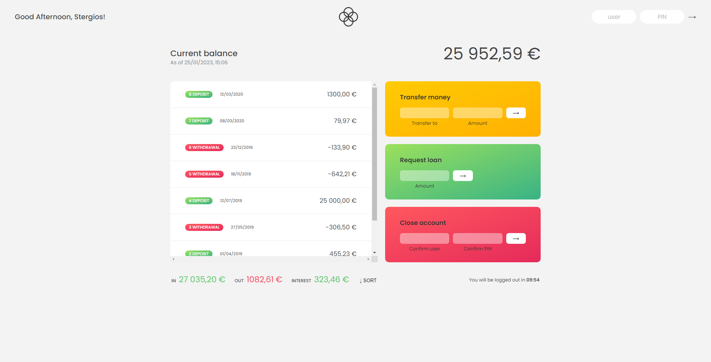

# ∞ Bankist Application

Bankist is a fictitious and minimalistic online banking application that allows the user to:

- Log in with a username and password
- View and sort their monetary movements
- Transfer money to another account
- Request a loan from the bank
- Delete their account

Log in credentials:

- username: sf | password: 1111
- username: gc | password 2222

## Deployment

Deployed Website: https://bankist-app-stergiosf.netlify.app

[](https://bankist-app-stergiosf.netlify.app/)

Bankist app is a minimal soothing design along with functionality to sign into account for further activities. Simply click on login and type the user credential provided on screen. This app uses modern JavaScript tools, such as Parcel to bundle the modules, and Babel to convert ES6, ES7 and ES8 back to ES5.

## Built With

- [HTML](https://developer.mozilla.org/en-US/docs/Web/HTML)
- [CSS](https://developer.mozilla.org/en-US/docs/Web/CSS)
- [JavaScript](https://developer.mozilla.org/en-US/docs/Web/javascript)
- [Parcel](https://parceljs.org/)
- [NPM](https://www.npmjs.com/)

## Getting Started

To get started with project just simply fork this repo or download locally on your System.

To get a local copy up and running follow these simple example steps.

### Installation

1. Clone the repo

```sh
git clone https://github.com/StergiosFotoglou/bankist-app.git
```

2. Install NPM packages

```sh
npm install npm@latest -g
```

3. Start a local server for the project

```sh
npm start
```

